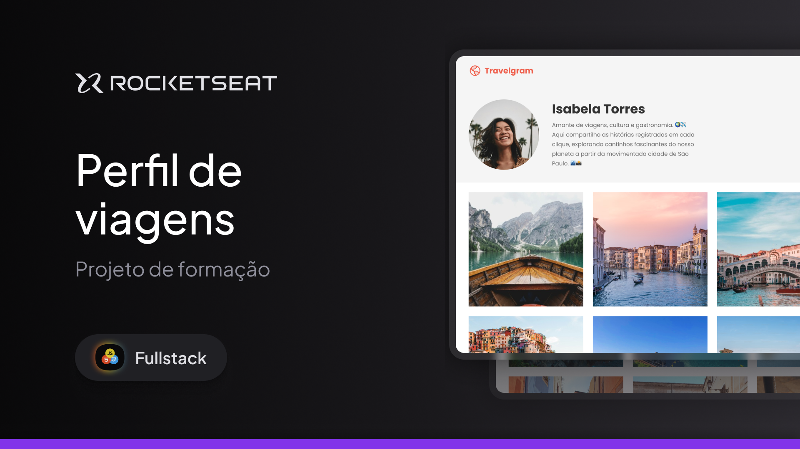

<h1 align="center"> Página de Receita </h1>

Esse projeto foi desenvolvido no curso Full Stack da Rocketseat!

  <a href="#-tecnologias">Tecnologias</a>&nbsp;&nbsp;&nbsp;|&nbsp;&nbsp;&nbsp;
  <a href="#-projeto">Projeto</a>&nbsp;&nbsp;&nbsp;|&nbsp;&nbsp;&nbsp;
  <a href="#-layout">Layout</a>&nbsp;&nbsp;&nbsp;|&nbsp;&nbsp;&nbsp;
  <a href="#memo-licença">Licença</a>

  

 

## 🚀 Tecnologias! 

Esse projeto foi desenvolvido com as seguintes tecnologias:

- HTML e CSS
- Git e Github
- Figma

## 💻 Projeto

Este projeto consiste em uma página de perfil de viagens, criada para explorar experiências de design e desenvolvimento web. Utilizando o Figma para prototipagem, HTML e CSS para construir a interface, e GitHub para versionamento e hospedagem, o projeto apresenta um design elegante e responsivo, pensado para compartilhar memórias e destinos de viagens de forma visual e organizada.

## 🔖 Layout

Você pode visualizar o layout do projeto através [DESSE LINK](https://www.figma.com/design/gxU8B505izNFMU4HOy2VLl/Perfil-de-viagens-(Community)?m=auto&t=SpWnTZiOmz199smH-6). É necessário ter conta no [Figma](https://figma.com) para acessá-lo.

## 🌌 Ver Site 
Confira aqui:https://luisfelipets17.github.io/projeto-travelgran/

## :memo: Licença

Esse projeto está sob a licença MIT.

---